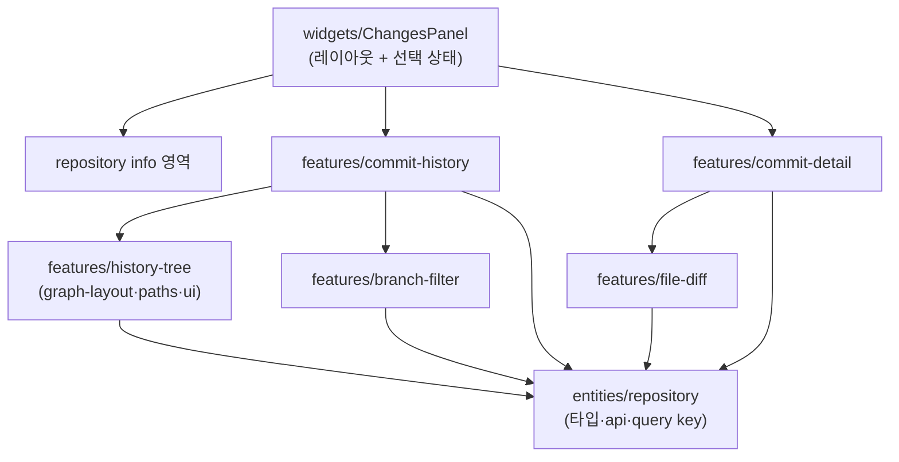
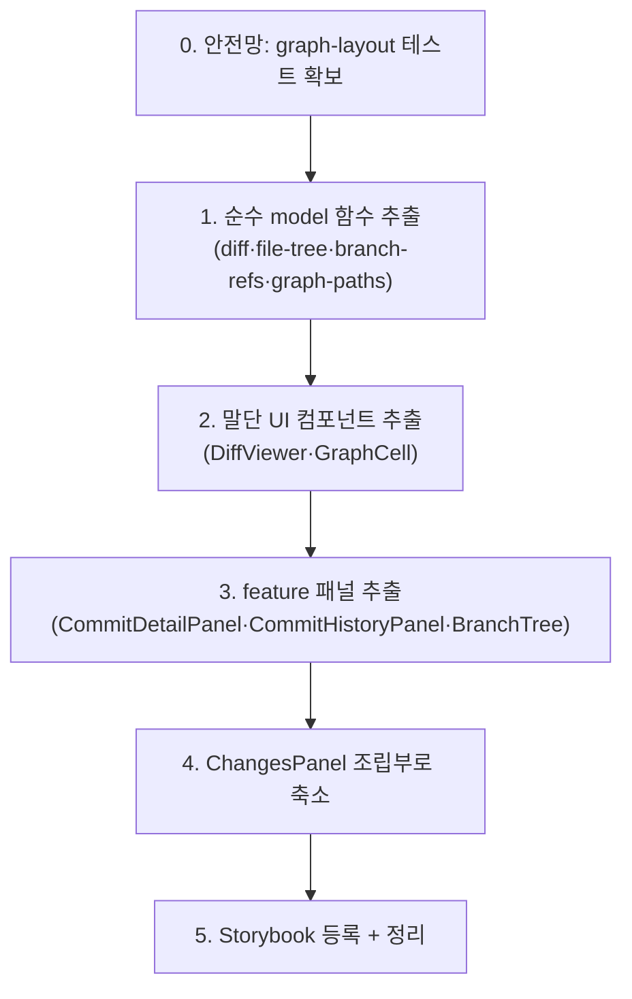

# ChangesPanel 분해 리팩터링 계획

## 배경

`apps/desktop/src/widgets/changes-panel/ui/ChangesPanel.tsx`는 약 1,600줄의 단일 파일로, 서로 다른 책임이 하나의 위젯에 응집되어 있다.

- 그래프 SVG 렌더링(`laneX`, `graphSegmentPath`, `GraphCell`, `HistoryGraphView`, `HistoryGraphRow`)
- diff 파싱·렌더링(`parseDiffLines`, `parseHunkHeader`, `DiffViewer`)
- 브랜치 트리 빌더(`buildBranchTreeRows`, `getBranchFolderPaths`)
- 파일 트리 빌더(`buildFileTree`, `compressFileTreeFolder`, `buildFileTreeRows`)
- 브랜치 필터 → ref 변환(`branchHistoryRefs`, `filterGraphByBranchControls`, `getReachableCommitHashes`)
- 8개 `useState` + 다수 `useEffect` + 6개 React Query 훅 + IntersectionObserver

feature sliced design을 표방하지만 실제로는 `features/history-tree/model/graph-layout.ts` 하나만 분리돼 있고 나머지 UI·로직은 위젯에 집중돼 있다. 그 결과 변경 영향 범위 파악, 재사용, Storybook 등록, 테스트가 모두 어렵다.

## 목표

- `ChangesPanel`은 **feature 컴포넌트를 조립하는 위젯**으로 축소한다(레이아웃 + 선택 상태 연결만 담당).
- 그래프/커밋 상세/파일 diff/브랜치 필터를 각각 독립 feature로 분리한다.
- 순수 계산 로직(`model`)과 표현(`ui`)을 feature 내부에서 분리해 테스트 가능하게 만든다.
- FSD 레이어 의존 방향(`widgets → features → entities → shared`)을 지킨다.

## 비목표

- 동작·UX 변경 없음. **순수 구조 리팩터링**이며 사용자 화면 결과는 동일해야 한다.
- Rust/Tauri command, 응답 스키마 변경 없음.
- UI 전역 상태의 Zustand 이관은 [client-state-with-zustand.md](./client-state-with-zustand.md)에서 별도로 다룬다(이 문서는 컴포넌트 경계까지만).

## 목표 디렉토리 구조

```
apps/desktop/src/
├─ features/
│  ├─ history-tree/                # 커밋 그래프 (기존 + 확장)
│  │  ├─ model/
│  │  │  ├─ graph-layout.ts        # (기존) lane/segment 계산
│  │  │  ├─ graph-paths.ts         # laneX, graphSegmentPath
│  │  │  └─ combine-graph-pages.ts # combineGitCommitGraphPages
│  │  └─ ui/
│  │     ├─ GraphCell.tsx
│  │     ├─ HistoryGraphView.tsx
│  │     └─ HistoryGraphRow.tsx
│  ├─ commit-history/              # 리스트/그래프 탭 + 무한 스크롤
│  │  ├─ model/use-commit-history.ts   # history/graph useInfiniteQuery + observer
│  │  └─ ui/CommitHistoryPanel.tsx
│  ├─ commit-detail/               # 커밋 상세 + 파일 트리
│  │  ├─ model/file-tree.ts        # buildFileTree, compressFileTreeFolder, buildFileTreeRows
│  │  └─ ui/CommitDetailPanel.tsx
│  ├─ file-diff/                   # diff 파싱 + 뷰어
│  │  ├─ model/parse-diff.ts       # parseDiffLines, parseHunkHeader, diffLineClassName
│  │  └─ ui/DiffViewer.tsx
│  └─ branch-filter/               # 브랜치 필터 컨트롤 + ref 변환
│     ├─ model/branch-refs.ts      # branchHistoryRefs, filterGraphByBranchControls, getReachableCommitHashes
│     └─ ui/BranchTree.tsx         # buildBranchTreeRows 기반 트리 + 필터 토글
└─ widgets/
   └─ changes-panel/
      └─ ui/ChangesPanel.tsx       # 3-패널 레이아웃 조립 + 선택 상태 연결만
```

`refsByTarget`, `getShortHash`, `getShortCommit`, `fileStatusClassName` 같은 범용 헬퍼는 사용처가 feature 하나면 해당 feature `model`에, 둘 이상이면 `shared/lib`로 올린다.

## 책임 분해 매핑

현재 `ChangesPanel.tsx` 내 요소 → 목적지.

| 현재 요소 (대략 위치) | 목적지 | 레이어 |
|------------------------|--------|--------|
| `laneX`, `graphSegmentPath` | `features/history-tree/model/graph-paths.ts` | feature/model |
| `GraphCell` | `features/history-tree/ui/GraphCell.tsx` | feature/ui |
| `HistoryGraphView`, `HistoryGraphRow` | `features/history-tree/ui/` | feature/ui |
| `combineGitCommitGraphPages` | `features/history-tree/model/combine-graph-pages.ts` | feature/model |
| history/graph `useInfiniteQuery` + IntersectionObserver `useEffect` | `features/commit-history/model/use-commit-history.ts` | feature/model |
| commit-log 섹션 JSX (List/Graph 탭) | `features/commit-history/ui/CommitHistoryPanel.tsx` | feature/ui |
| `buildFileTree`, `compressFileTreeFolder`, `buildFileTreeRows`, `getFileFolderPaths` | `features/commit-detail/model/file-tree.ts` | feature/model |
| commit-detail 섹션 JSX (파일 트리/리스트) | `features/commit-detail/ui/CommitDetailPanel.tsx` | feature/ui |
| `parseDiffLines`, `parseHunkHeader`, `diffLineClassName` | `features/file-diff/model/parse-diff.ts` | feature/model |
| `DiffViewer` | `features/file-diff/ui/DiffViewer.tsx` | feature/ui |
| `branchHistoryRefs`, `filterGraphByBranchControls`, `getReachableCommitHashes`, `branchGraphRefKind`, `branchGraphRefKey`, `graphRefKey` | `features/branch-filter/model/branch-refs.ts` | feature/model |
| `buildBranchTreeRows`, `getBranchFolderPaths`, `isBranchVisible` + 브랜치 트리 JSX | `features/branch-filter/ui/BranchTree.tsx` | feature/ui |
| `loadColumnLayout`, `saveColumnLayout`, 3-패널 레이아웃, 선택 상태 연결 | `widgets/changes-panel/ui/ChangesPanel.tsx` (잔존) | widget |

## 분해 후 구성도



의존은 항상 아래 방향(widget → feature → entity)으로만 흐른다. feature 간 직접 의존이 필요하면(예: commit-history가 history-tree·branch-filter를 사용) 상위 feature가 하위 feature를 import하는 것은 허용하되, 순환은 만들지 않는다. 애매하면 공유 코드를 `entities` 또는 `shared`로 올린다.

## 단계별 마이그레이션

각 단계는 독립적으로 머지 가능하며, 매 단계 후 `pnpm typecheck`와 (있다면) 테스트를 통과시킨다. **선행 조건: [graph-layout 테스트](./graph-layout-testing.md)가 머지되어 있어야 한다.**



1. **순수 함수 우선 추출** — 부수효과 없는 `model` 함수부터 파일로 옮긴다(diff 파싱, 파일 트리, branch-refs, graph-paths). React에 의존하지 않아 위험이 가장 낮고, 곧바로 단위 테스트를 붙일 수 있다.
2. **말단 UI 컴포넌트 추출** — `DiffViewer`, `GraphCell`처럼 props만 받는 leaf 컴포넌트를 옮긴다.
3. **feature 패널 추출** — commit-detail/commit-history/branch-tree 섹션 JSX와 관련 query/effect를 feature로 옮긴다. 무한 스크롤 IntersectionObserver는 `use-commit-history` 훅으로 캡슐화한다.
4. **`ChangesPanel` 축소** — 위젯에는 3-패널 레이아웃, 컬럼 레이아웃 저장, `selectedCommitHash`/`selectedFilePath` 등 **여러 feature가 공유하는 선택 상태의 연결**만 남긴다.
5. **마무리** — 분리한 feature 컴포넌트를 Storybook(atomic design: 트리/diff는 Molecules, 패널은 Organisms)에 등록하고 empty/loading/error·긴 경로·바이너리 diff 등 샘플을 추가한다.

## 선택 상태 처리 방침

분해 과정에서 `selectedCommitHash`, `selectedFilePath`, `historyView`, `fileChangeView`, `expandedBranchFolders`, `expandedFileFolders`, `filteredBranchKeys`, `hiddenBranchKeys` 등 위젯이 들고 있던 상태가 여러 feature에 걸쳐 있음이 드러난다.

- 1차 분해에서는 이 상태들을 `ChangesPanel`에 그대로 두고 **props로 내려보내** 동작 동일성을 우선 확보한다.
- 분해가 끝나 경계가 분명해지면, 전역적으로 공유되는 선택/표시 상태를 [Zustand store](./client-state-with-zustand.md)로 이관해 prop drilling을 제거한다.

## 위험과 대응

| 위험 | 대응 |
|------|------|
| graph lane 계산 결과가 미묘하게 달라짐 | 과제 1의 스냅샷/단위 테스트로 분해 전후 출력 동일성 검증 |
| `useEffect` 의존성 배열 누락으로 동작 변화 | 단계 3에서 effect를 훅으로 옮길 때 의존성 그대로 유지, 수동 회귀 확인 |
| feature 간 순환 import | 공유 코드는 entities/shared로 승격, feature 간 단방향 유지 |
| 대형 PR로 리뷰 불가 | 단계별 독립 머지, 단계당 변경 파일 최소화 |

## 완료 기준

- [ ] `ChangesPanel.tsx`가 레이아웃/선택 상태 연결 중심으로 축소된다(목표: 300줄 이하).
- [ ] diff·file-tree·branch-refs·graph 계산 로직이 feature `model`로 분리되어 단위 테스트가 가능하다.
- [ ] 분리한 주요 컴포넌트가 Storybook에 등록된다.
- [ ] `pnpm typecheck`, `pnpm --filter desktop test`, `pnpm build`가 통과한다.
- [ ] 앱 동작(히스토리 리스트/그래프 전환, 브랜치 필터, 커밋 상세, diff, 무한 스크롤)이 리팩터링 전과 동일하다.
