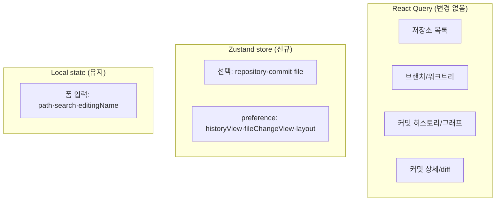
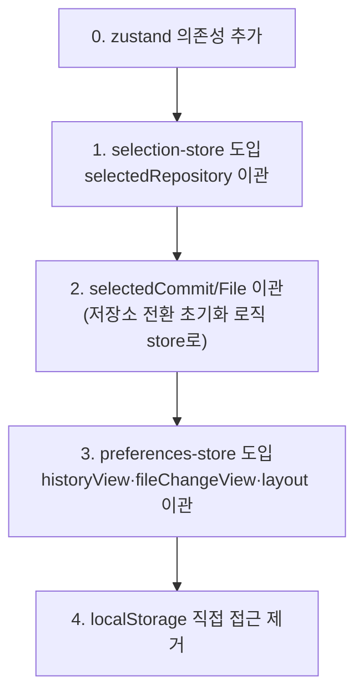

# 클라이언트 전역 상태 Zustand 도입 계획

## 배경

AGENTS.md의 State Management 규칙은 다음과 같이 상태를 3계층으로 나눈다.

- 서버 상태·비동기 요청·캐시·revalidation → **React Query**
- 클라이언트 전역 상태·UI preference·선택 상태·임시 session state → **Zustand**
- 컴포넌트 내부에서 의미가 끝나는 상태 → **React local state**

그러나 현재 코드에는 **Zustand가 의존성에도 없고 사용처도 없다.** UI 전역/선택 상태가 컴포넌트 `useState`와 `localStorage` 직접 접근으로 흩어져 있어 지침과 어긋난다.

이 과제는 [ChangesPanel 분해](./changes-panel-refactoring.md)가 끝나 상태 경계가 분명해진 뒤 진행하는 것을 권장한다(로드맵 과제 3).

## 현재 상태 분포

| 상태 | 위치 | 성격 | 분류 |
|------|------|------|------|
| `selectedRepository` | `RepositoryPage` (useState) | 전역 선택 | → Zustand |
| `selectedCommitHash` | `ChangesPanel` (useState) | 전역 선택 | → Zustand |
| `selectedFilePath` | `ChangesPanel` (useState) | 전역 선택 | → Zustand |
| `historyView` (list/graph) | `ChangesPanel` (useState) | UI preference | → Zustand(persist) |
| `fileChangeView` (tree/list) | `ChangesPanel` (useState) | UI preference | → Zustand(persist) |
| 패널 레이아웃 | `RepositoryPage`·`ChangesPanel` (localStorage 직접) | UI preference | → Zustand(persist) |
| `expandedBranchFolders` / `expandedFileFolders` | `ChangesPanel` (useState) | 저장소 종속 임시 표시 | local 유지 또는 Zustand(비영속) |
| `filteredBranchKeys` / `hiddenBranchKeys` | `ChangesPanel` (useState) | 저장소 종속 필터 | local 유지 또는 Zustand(비영속) |
| `path` / `search` / `editingRepositoryId` / `editingName` | `RepositorySidebar` (useState) | 폼 입력 | **local 유지** |

핵심 판단:
- **선택 상태와 UI preference**는 여러 컴포넌트가 공유하고 화면 경계를 넘으므로 Zustand로 올린다.
- **폼 입력**(경로 입력, 검색어, 이름 편집)은 컴포넌트 내부에서 의미가 끝나므로 local state로 둔다.
- **저장소 데이터 자체**(목록·브랜치·히스토리·diff)는 서버 상태이므로 **React Query에 그대로 둔다.** Zustand로 옮기지 않는다.



## Store 설계

선택 상태와 표시 옵션을 분리해 두 개의 store(또는 slice)로 구성한다. 영속이 필요한 preference만 `persist` 미들웨어를 적용한다.

```ts
// apps/desktop/src/shared/store/selection-store.ts
import { create } from "zustand";

type SelectionState = {
  selectedRepositoryId?: string;
  selectedCommitHash?: string;
  selectedFilePath?: string;
  selectRepository: (id?: string) => void;
  selectCommit: (hash?: string) => void;
  selectFile: (path?: string) => void;
};

export const useSelectionStore = create<SelectionState>((set) => ({
  selectRepository: (selectedRepositoryId) =>
    // 저장소가 바뀌면 하위 선택을 초기화한다 (기존 useEffect 동작 보존)
    set({ selectedRepositoryId, selectedCommitHash: undefined, selectedFilePath: undefined }),
  selectCommit: (selectedCommitHash) =>
    set({ selectedCommitHash, selectedFilePath: undefined }),
  selectFile: (selectedFilePath) => set({ selectedFilePath }),
}));
```

```ts
// apps/desktop/src/shared/store/preferences-store.ts
import { create } from "zustand";
import { persist } from "zustand/middleware";

type HistoryView = "list" | "graph";
type FileChangeView = "tree" | "list";

type PreferencesState = {
  historyView: HistoryView;
  fileChangeView: FileChangeView;
  setHistoryView: (view: HistoryView) => void;
  setFileChangeView: (view: FileChangeView) => void;
};

export const usePreferencesStore = create<PreferencesState>()(
  persist(
    (set) => ({
      historyView: "list",
      fileChangeView: "tree",
      setHistoryView: (historyView) => set({ historyView }),
      setFileChangeView: (fileChangeView) => set({ fileChangeView }),
    }),
    { name: "repository-preferences" },
  ),
);
```

> 패널 레이아웃은 `react-resizable-panels`의 `onLayoutChanged` 콜백과 결합돼 있다. 이를 `persist` store로 옮기면 `loadColumnLayout`/`saveColumnLayout`의 `localStorage` 직접 접근과 try/catch 파싱을 제거할 수 있다. store 키 이름을 기존 `repository-layout`·`repository-detail-columns-layout`과 맞춰 마이그레이션 시 기존 사용자 설정을 보존한다.

## 저장소 종속 상태(펼침/필터) 처리

`expandedBranchFolders`, `filteredBranchKeys` 등은 "현재 선택된 저장소"에 종속된 임시 상태다. 저장소가 바뀌면 초기화되어야 한다(현재 `useEffect`가 담당).

- **권장(1차)**: local state로 유지하되, 분해된 `features/branch-filter` 안으로 함께 이동시킨다. 전역화 이득이 작고, 저장소 전환 시 초기화 로직이 단순하다.
- **선택(후속)**: 화면 새로고침을 넘어 유지할 필요가 생기면 `selectedRepositoryId`를 키로 하는 비영속 Zustand slice(`Record<repositoryId, ...>`)로 승격한다.

## 마이그레이션 단계



1. `apps/desktop`에 `zustand` 의존성을 추가한다.
2. `selection-store`를 만들고 `RepositoryPage`의 `selectedRepository`를 `selectedRepositoryId`로 이관한다. 컴포넌트는 `useSelectionStore`에서 읽고 쓴다. (저장소 **객체**가 필요하면 id로 React Query 캐시에서 조회한다 — 객체 전체를 store에 넣지 않는다.)
3. `selectedCommitHash`·`selectedFilePath`를 store로 옮기고, 기존 "저장소/커밋 변경 시 하위 선택 초기화" `useEffect`를 store 액션 안으로 흡수한다.
4. `preferences-store`(persist)를 만들어 `historyView`·`fileChangeView`·패널 레이아웃을 이관한다.
5. `loadColumnLayout`/`saveColumnLayout` 등 `localStorage` 직접 접근 코드를 제거한다.

## 경계 원칙(반드시 지킬 것)

- **서버 상태를 Zustand에 복제하지 않는다.** 저장소 목록·브랜치·히스토리·diff는 React Query가 단일 출처다. store에는 "무엇을 선택했는가(id)"만 둔다.
- **파생 상태를 store에 저장하지 않는다.** `branchRefs`, `graphRows` 같은 계산 결과는 렌더 시 selector/메모로 계산한다.
- **폼 입력은 local state로 둔다.** 검색어·경로 입력·이름 편집을 전역화하지 않는다.
- selector는 필요한 필드만 구독해 불필요한 리렌더를 막는다(`useSelectionStore((s) => s.selectedCommitHash)`).

## 완료 기준

- [ ] `zustand`가 `apps/desktop` 의존성에 추가된다.
- [ ] 선택 상태(repository·commit·file)와 UI preference(view·layout)가 store로 이관된다.
- [ ] `localStorage` 직접 접근(`loadLayout`/`saveLayout`/`loadColumnLayout`/`saveColumnLayout`)이 `persist`로 대체된다.
- [ ] 저장소 데이터·diff 등 서버 상태는 React Query에 그대로 유지된다.
- [ ] `pnpm typecheck`가 통과하고 선택/뷰 전환/레이아웃 영속 동작이 기존과 동일하다.
