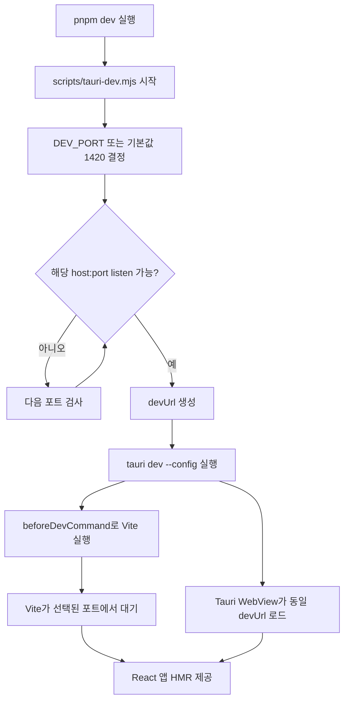
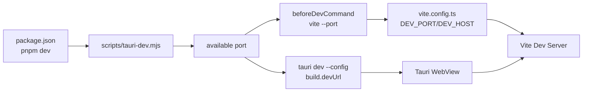

# 개발 서버 및 앱 실행 시 동적 포트 적용

## 배경

Tauri 개발 실행은 프론트엔드 개발 서버와 데스크톱 앱 실행이 함께 맞물린다. 기존 설정은 `apps/desktop/src-tauri/tauri.conf.json`의 `build.devUrl`과 `apps/desktop/vite.config.ts`의 Vite 개발 서버 포트를 모두 `1420`으로 고정했다.

이 방식은 단순하지만, 이미 다른 프로젝트나 이전 실행 프로세스가 `1420`을 사용 중이면 `pnpm dev`가 실패한다. 특히 여러 Tauri/Vite 프로젝트를 동시에 다루는 개발 환경에서는 고정 포트 충돌이 쉽게 발생한다.

## 조사 결과

Vite는 지정한 포트가 사용 중일 때 다음 포트를 자동으로 시도할 수 있다. 그러나 Tauri는 `tauri dev` 실행 시 `build.devUrl` 값을 사용해 WebView가 접속할 주소를 결정한다.

따라서 Vite만 자동 포트를 사용하게 두면 문제가 생긴다. 예를 들어 Vite가 `1420` 대신 `1421`에서 실행되더라도 Tauri WebView는 여전히 `http://localhost:1420`을 바라볼 수 있다. 결과적으로 빈 화면이나 연결 실패가 발생한다.

핵심은 실행 시점에 하나의 포트를 먼저 결정하고, 그 포트를 Vite와 Tauri `devUrl`에 동시에 전달하는 것이다.

## 적용 방식

루트 `pnpm dev`는 이제 `scripts/tauri-dev.mjs`를 실행한다. 이 스크립트는 기본 포트 `1420`부터 사용 가능한 포트를 탐색하고, 선택된 포트를 기반으로 Tauri CLI의 `--config` 옵션을 사용해 `build.devUrl`과 `beforeDevCommand`를 런타임에 덮어쓴다.

주요 파일은 다음과 같다.

- `scripts/tauri-dev.mjs`: 빈 포트 탐색 및 Tauri dev 실행 래퍼
- `package.json`: `dev`, `tauri:dev` 스크립트 진입점
- `apps/desktop/vite.config.ts`: `DEV_HOST`, `DEV_PORT` 기반 Vite 서버 설정

## 실행 흐름



## 구현 상세

`scripts/tauri-dev.mjs`는 Node.js `net` 모듈로 포트를 직접 열어볼 수 있는지 검사한다. `EADDRINUSE` 또는 `EACCES`가 발생하면 해당 포트는 건너뛰고 다음 포트를 확인한다.

선택된 포트는 다음 두 위치에 동시에 반영된다.

```json
{
  "build": {
    "devUrl": "http://127.0.0.1:<port>",
    "beforeDevCommand": "pnpm exec vite --host 127.0.0.1 --port <port> --strictPort"
  }
}
```

`--strictPort`를 유지하는 이유는 래퍼가 이미 포트를 결정했기 때문이다. Vite가 다시 임의로 다른 포트로 이동하면 Tauri `devUrl`과 불일치할 수 있으므로, 선택된 포트에서 실행할 수 없으면 즉시 실패하는 편이 안전하다.

## 설정 관계



## 환경 변수

- `DEV_PORT`: 탐색을 시작할 포트다. 없으면 `1420`을 사용한다.
- `PORT`: `DEV_PORT`가 없을 때 대체 시작 포트로 사용한다.
- `DEV_HOST`: 개발 서버 host다. 없으면 `127.0.0.1`을 사용한다.
- `TAURI_DEV_HOST`: Tauri 모바일/네트워크 실행 환경에서 전달될 수 있는 host이며 `DEV_HOST`보다 우선한다.

## 검증

다음 명령으로 정적 검증을 수행했다.

```sh
pnpm -r exec tsc --noEmit
pnpm --filter desktop build
cargo check --manifest-path apps/desktop/src-tauri/Cargo.toml
git diff --check
```

또한 `pnpm dev`를 실제 실행해 Tauri 앱과 Vite 개발 서버가 같은 포트로 시작되는 것을 확인했다.

## 한계와 주의점

포트 탐색과 실제 Vite listen 사이에는 짧은 경쟁 구간이 있다. 일반적인 로컬 개발에서는 충분히 실용적인 방식이지만, 같은 순간 다른 프로세스가 동일 포트를 선점하면 Vite가 `--strictPort`로 실패할 수 있다. 이 경우 다시 실행하면 다음 가능한 포트를 새로 탐색한다.

`tauri.conf.json`의 `build.devUrl`은 기본 fallback으로 남아 있다. 실제 루트 `pnpm dev` 실행에서는 `scripts/tauri-dev.mjs`가 `--config`로 런타임 설정을 덮어쓴다.
