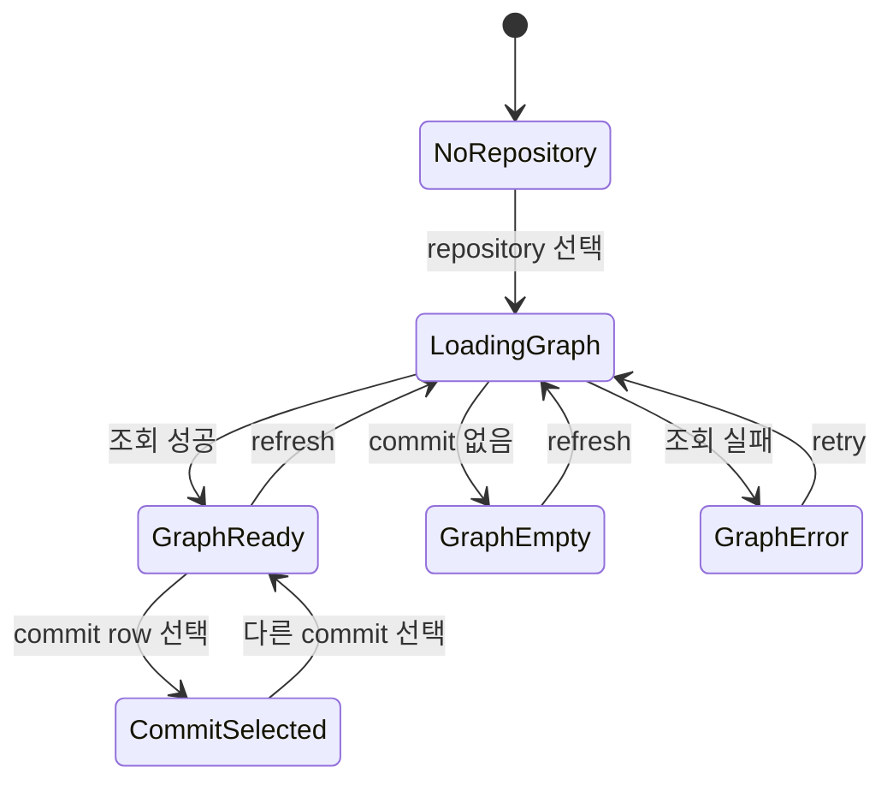
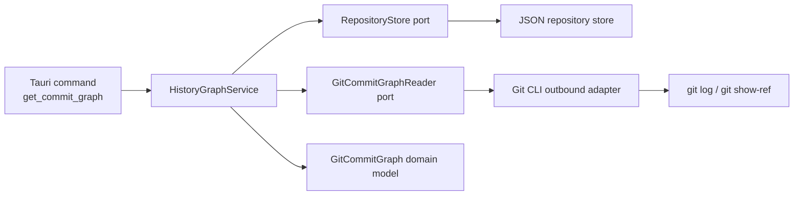
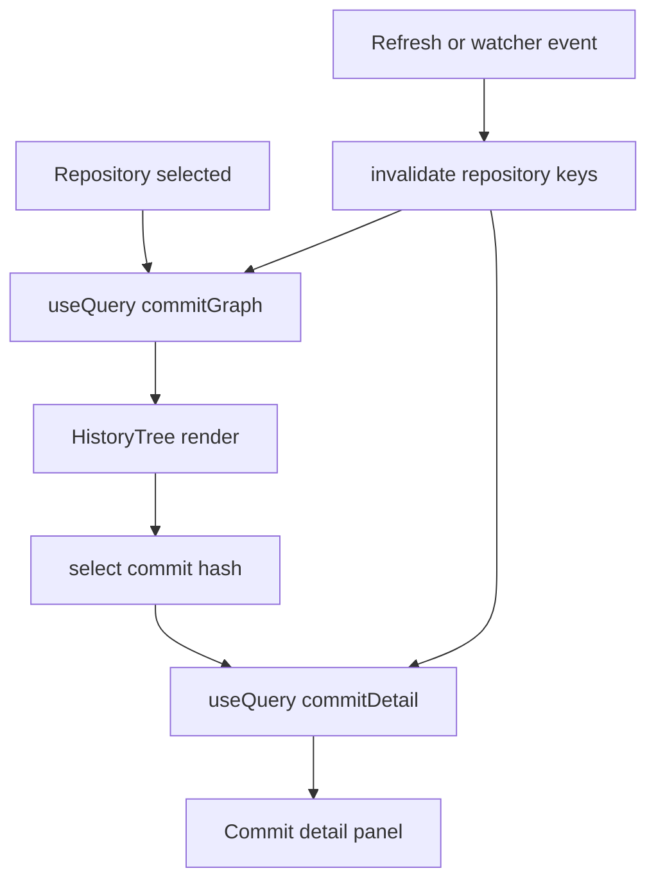

# Git History Tree 설계

## 배경

현재 Git history는 선택한 repository의 commit 목록을 시간순 테이블로 보여주는 흐름을 기준으로 한다. 이 방식은 최신 commit을 빠르게 확인하기에는 충분하지만, 여러 branch가 병합되거나 같은 시점에 병렬 작업이 진행된 경우 branch/merge 관계를 파악하기 어렵다.

Git history tree는 commit 간 parent 관계와 branch tip 정보를 함께 사용해 commit graph를 시각화하는 화면이다. 이 문서는 구현 전에 필요한 화면 동작, 데이터 모델, Rust/React 책임 경계, 후속 구현 단위를 정의한다.

## 목표

- 사용자가 선택한 repository의 commit graph를 branch/merge 관계가 보이는 tree 형태로 확인한다.
- commit graph 데이터는 Rust application port를 통해 조회하고 outbound adapter가 Git CLI 세부사항을 처리한다.
- React는 graph 응답을 React Query로 캐시하고, 화면 확장/선택 같은 UI 상태는 local state 또는 Zustand로 관리한다.
- 기존 commit history, commit detail, branch, worktree 조회 구조와 충돌하지 않는 feature sliced design 배치를 유지한다.

## 비목표

- 이 문서에서는 실제 graph 렌더러를 구현하지 않는다.
- 모든 Git graph layout 알고리즘을 처음부터 완성하지 않는다. 초기 구현은 Git CLI의 topo-order 결과를 사용해 안정적인 기본 레이아웃을 만든다.
- commit diff, file tree, watcher revalidation은 별도 이슈에서 다룬다.

## 사용자 화면 설계

History 영역은 기존 선형 목록을 대체하거나 탭으로 분리할 수 있다. 초기 구현에서는 `History` 섹션 안에 `List`와 `Tree` 탭을 두는 방식을 권장한다.

- `List`: 기존 commit history 테이블을 유지한다.
- `Tree`: commit graph lane과 commit row를 함께 표시한다.

Tree row는 다음 정보를 포함한다.

- graph lane: parent/merge 관계를 선으로 표현한다.
- short hash: 8자 hash를 표시한다.
- message: commit subject를 표시한다.
- refs: branch/tag가 가리키는 commit이면 badge로 표시한다.
- author/date: 기존 history 정보와 같은 의미로 표시한다.
- 선택 상태: row 클릭 시 commit detail 패널을 갱신한다.

상호작용은 다음 기준으로 설계한다.

- repository 선택 시 graph를 조회한다.
- refresh 버튼은 history tree, branch, worktree, commit detail의 관련 query를 invalidate 또는 refetch 한다.
- commit row 선택 시 기존 commit detail 조회를 재사용한다.
- graph 조회 실패 시 tree 영역에 오류 상태를 표시한다.
- graph 데이터가 비어 있으면 빈 상태를 표시한다.
- branch/tag badge 클릭은 후속 이슈에서 필터링 또는 checkout 연계로 확장할 수 있다.

## 화면 흐름



## 데이터 모델

Rust domain은 Git CLI 출력 형식에 의존하지 않는 graph 모델만 가진다.

```rust
pub struct GitCommitGraph {
    pub commits: Vec<GitGraphCommit>,
    pub refs: Vec<GitGraphRef>,
}

pub struct GitGraphCommit {
    pub hash: String,
    pub parents: Vec<String>,
    pub message: String,
    pub author: String,
    pub date: String,
    pub lane: usize,
    pub edges: Vec<GitGraphEdge>,
}

pub struct GitGraphEdge {
    pub from: String,
    pub to: String,
    pub from_lane: usize,
    pub to_lane: usize,
}

pub struct GitGraphRef {
    pub name: String,
    pub target: String,
    pub kind: GitGraphRefKind,
}

pub enum GitGraphRefKind {
    LocalBranch,
    RemoteBranch,
    Tag,
}
```

Tauri 응답은 camelCase JSON을 사용한다.

```ts
export type GitCommitGraph = {
  commits: GitGraphCommit[];
  refs: GitGraphRef[];
};

export type GitGraphCommit = {
  hash: string;
  parents: string[];
  message: string;
  author: string;
  date: string;
  lane: number;
  edges: GitGraphEdge[];
};

export type GitGraphEdge = {
  from: string;
  to: string;
  fromLane: number;
  toLane: number;
};

export type GitGraphRef = {
  name: string;
  target: string;
  kind: "localBranch" | "remoteBranch" | "tag";
};
```

## API 설계

Tauri command는 repository id를 받아 등록된 repository인지 확인한 뒤 graph를 반환한다.

```ts
invoke<GitCommitGraph>("get_commit_graph", {
  request: {
    repositoryId,
    maxCount: 300,
  },
});
```

`maxCount`는 초기 렌더링 비용을 제한하기 위한 선택값이다. 지정하지 않으면 application service에서 기본값을 적용한다.

React Query key는 기존 repository key 체계 아래에 둔다.

```ts
repositoryKeys.commitGraph(repositoryId, { maxCount: 300 })
```

## Rust 책임 범위



### inbound adapter

- Tauri command request/response 직렬화를 담당한다.
- UI 요청을 application service로 전달한다.
- repository id, maxCount 같은 입력 DTO를 application 계층 타입으로 전달한다.

### application service

- repository id가 등록된 repository인지 `RepositoryStore` port로 확인한다.
- maxCount 기본값과 상한을 적용한다.
- `GitCommitGraphReader` port를 호출한다.
- adapter 오류를 사용자에게 전달 가능한 메시지로 보존한다.

### outbound adapter

- Git CLI 호출과 출력 파싱을 담당한다.
- 후보 명령:
  - `git log --topo-order --date=iso-strict --pretty=format:%H%x00%P%x00%s%x00%an%x00%cI`
  - `git show-ref --heads --tags`
  - remote branch는 필요하면 `git branch --remotes --format=...`와 조합한다.
- lane 계산은 초기에는 adapter 내부의 parser/helper에서 수행한다. 복잡도가 커지면 application 내부 pure function으로 이동할 수 있다.

### domain

- commit graph 결과 타입만 가진다.
- Git CLI, filesystem, Tauri, JSON 저장소에 의존하지 않는다.

## React 배치

Feature sliced design 기준 배치는 다음과 같다.

- `entities/repository`
  - `GitCommitGraph` 타입
  - `getCommitGraph` API 함수
  - `repositoryKeys.commitGraph`
- `features/history-tree`
  - graph row 렌더링
  - lane SVG/canvas 또는 table overlay 컴포넌트
  - 선택/hover 이벤트 처리
- `widgets/changes-panel`
  - `History` 섹션의 list/tree 탭 조립
  - selected commit detail 패널과 graph 선택 상태 연결
- `shared`
  - graph 렌더링에 필요한 범용 geometry helper가 생길 경우 배치

초기 구현에서는 별도 라우트보다 현재 repository page의 main panel 안에서 확장하는 것이 좋다. repository 선택과 detail panel 컨텍스트를 재사용할 수 있기 때문이다.

## 상태 관리

서버 상태는 React Query를 사용한다.

- commit graph 조회
- commit detail 조회
- branch/worktree/history 조회

UI 상태는 범위에 따라 나눈다.

- tree/list 탭 선택: component local state
- selected commit hash: 기존 detail panel과 공유가 필요하면 Zustand, 단일 panel 내부면 local state
- graph row hover/expanded 상태: local state
- graph 옵션(maxCount, branch filter)이 앱 전역 preference가 되면 Zustand



## 후속 구현 이슈

1. Rust commit graph port 및 Tauri command 구현
   - `GitCommitGraphReader` port 추가
   - Git CLI adapter에서 topo-order log와 ref 목록 파싱
   - graph domain model 직렬화

2. React commit graph API 및 query 추가
   - `GitCommitGraph` 타입과 `getCommitGraph` API 추가
   - `repositoryKeys.commitGraph` 추가
   - loading/error/empty 상태 처리

3. History tree UI 구현
   - list/tree 탭 추가
   - lane/edge 렌더링
   - commit row 선택과 commit detail 패널 연결

4. Graph layout 개선
   - merge edge가 많은 repository에서 lane 충돌을 줄인다.
   - long edge, hidden edge, collapsed segment 표현을 추가한다.

5. Branch/tag 필터와 검색
   - branch badge 또는 검색어로 graph를 좁힌다.
   - 선택한 branch의 reachable commits만 표시하는 옵션을 추가한다.

6. Watcher 연동
   - filesystem/Git metadata 변경 이벤트 발생 시 commit graph query를 invalidate 한다.
   - 짧은 시간 내 다중 이벤트는 debounce 또는 coalescing 한다.

## 검증 관점

- 등록되지 않은 repository id는 오류를 반환해야 한다.
- commit이 없는 repository는 빈 graph를 반환해야 한다.
- merge commit은 parent가 2개 이상이어야 한다.
- local branch, remote branch, tag ref가 target hash와 함께 반환되어야 한다.
- React tree 화면은 graph 조회 loading/error/empty/success 상태를 모두 표현해야 한다.
- 기존 commit detail 선택 흐름과 충돌하지 않아야 한다.
