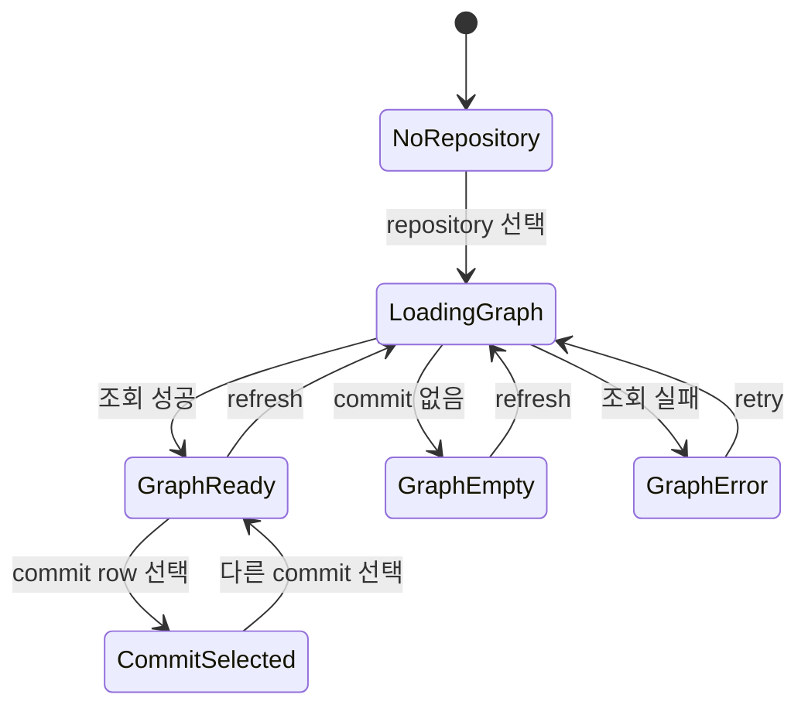
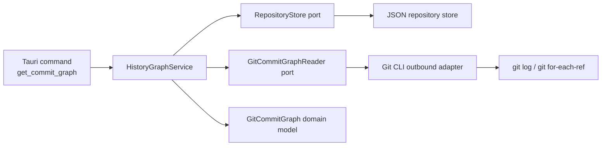
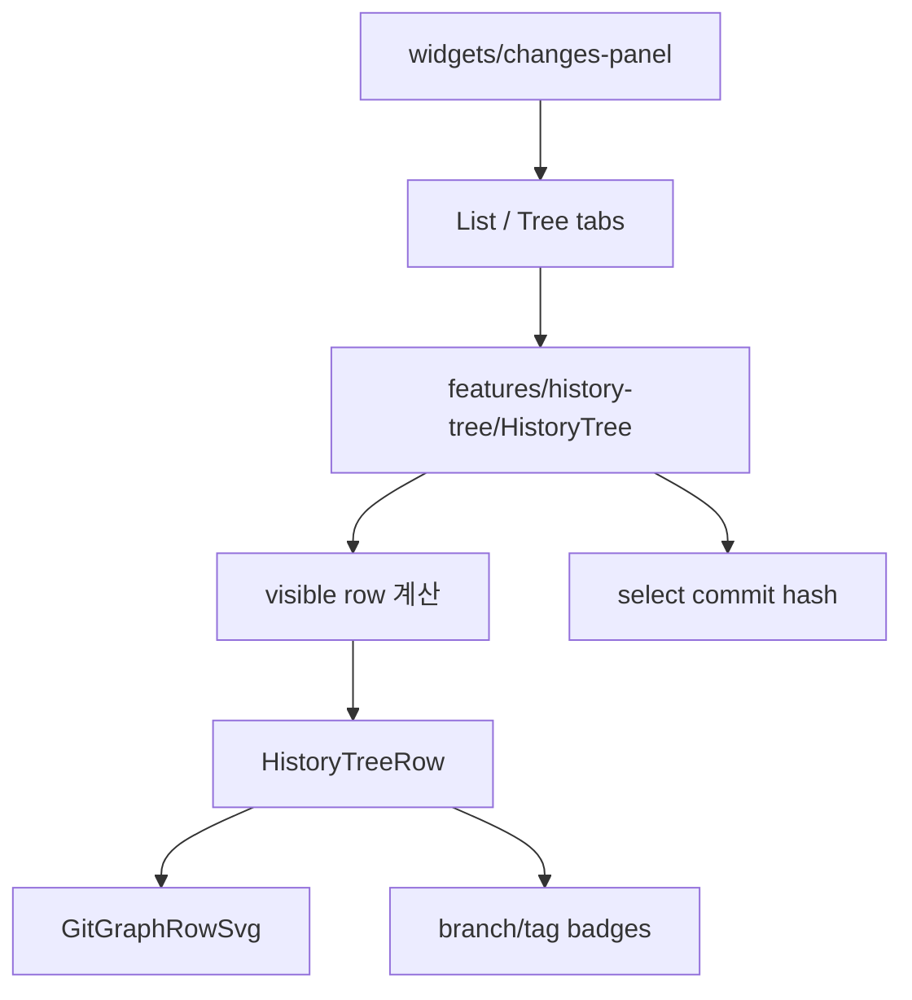
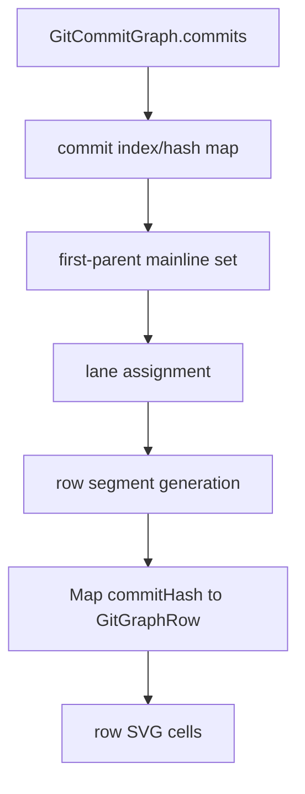
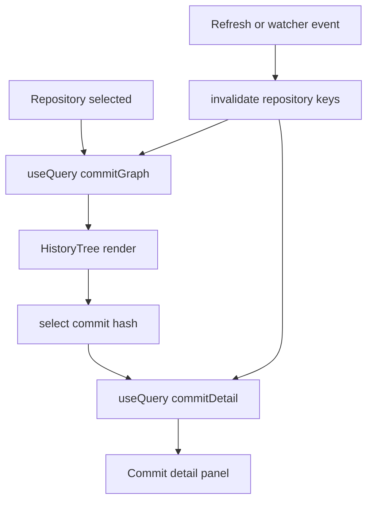

# Git History Tree 설계

## 배경

현재 Git history는 선택한 repository의 commit 목록을 시간순 테이블로 보여주는 흐름을 기준으로 한다. 이 방식은 최신 commit을 빠르게 확인하기에는 충분하지만, 여러 branch가 병합되거나 같은 시점에 병렬 작업이 진행된 경우 branch/merge 관계를 파악하기 어렵다.

Git history tree는 commit 간 parent 관계와 branch tip 정보를 함께 사용해 commit graph를 시각화하는 화면이다. 이 문서는 구현 전에 필요한 화면 동작, 데이터 모델, Rust/React 책임 경계, 후속 구현 단위를 정의한다.

## 참고 프로젝트 조사 결과

`/Users/yoophi/private/spec-cat`는 Git graph를 다음 구조로 구현하고 있다.

- 서버 API는 commit/ref/status/stash 같은 원천 데이터를 제공한다.
  - `/api/git/log`는 `git log --exclude=refs/stash --all --topo-order --format="%H|%h|%an|%ae|%at|%s|%P"` 결과를 파싱한다.
  - branch와 tag는 `for-each-ref` 결과를 target hash 기준으로 commit에 붙인다.
  - `/api/git/state`는 `HEAD`, branch ref hash, worktree hash, stash hash를 반환해 변경 감지에 사용한다.
- 프론트엔드는 commit parent 관계를 받아 row 단위 SVG layout을 계산한다.
  - `useGitGraph.computeGraphRows`가 mainline first-parent chain을 lane 0에 두고, side branch는 lane 1부터 빈 lane을 재사용한다.
  - 각 row는 `vertical-top`, `vertical-bottom`, `vertical`, `branch-in/out`, `merge-in/out` segment를 가진다.
  - `GitGraphSvg`는 row 하나의 SVG cell만 렌더링한다. 전체 graph를 하나의 거대한 SVG/canvas로 그리지 않는다.
- 렌더링은 virtual scroll과 결합되어 있다.
  - 고정 `ROW_HEIGHT`를 사용해 commit row와 graph cell을 정렬한다.
  - visible range만 렌더링하고, 전체 높이는 spacer로 유지한다.
- UI 기능은 graph rendering core와 분리되어 있다.
  - search/filter, branch/tag badge, context menu, commit detail, diff viewer가 graph row 위에 얹힌다.
  - graph style은 rounded/angular 두 가지 path 스타일로 확장된다.
- auto refresh는 변경 이벤트를 바로 full reload하지 않고 state snapshot 비교, debounce, interaction deferral, scroll position restore를 함께 사용한다.

이 프로젝트에 그대로 맞지 않는 점도 있다. `spec-cat`는 Nuxt/Pinia와 서버 API 기반이고, 이 앱은 Tauri/Rust application port와 React Query/Zustand 기반이다. 따라서 구현 아이디어는 가져오되, Git CLI 접근과 repository 검증은 Rust outbound adapter/application service로 유지한다.

## 목표

- 사용자가 선택한 repository의 commit graph를 branch/merge 관계가 보이는 tree 형태로 확인한다.
- commit graph 데이터는 Rust application port를 통해 조회하고 outbound adapter가 Git CLI 세부사항을 처리한다.
- React는 graph 원천 데이터를 React Query로 캐시하고, lane/segment layout은 순수 client helper로 계산한다.
- 화면 확장/선택/표시 옵션 같은 UI 상태는 local state 또는 Zustand로 관리한다.
- 기존 commit history, commit detail, branch, worktree 조회 구조와 충돌하지 않는 feature sliced design 배치를 유지한다.

## 비목표

- 이 문서에서는 실제 graph 렌더러를 구현하지 않는다.
- 모든 Git graph layout 알고리즘을 처음부터 완성하지 않는다. 초기 구현은 Git CLI의 topo-order 결과를 사용해 안정적인 기본 레이아웃을 만든다.
- Rust 응답에 pixel 좌표나 SVG path를 포함하지 않는다. 렌더링 좌표는 React 영역에서 계산한다.
- commit diff, file tree, watcher revalidation은 별도 이슈에서 다룬다.

## 사용자 화면 설계

History 영역은 기존 선형 목록을 대체하거나 탭으로 분리할 수 있다. 초기 구현에서는 `History` 섹션 안에 `List`와 `Tree` 탭을 두는 방식을 권장한다.

- `List`: 기존 commit history 테이블을 유지한다.
- `Tree`: commit graph lane과 commit row를 함께 표시한다.

Tree row는 다음 정보를 포함한다.

- graph lane: parent/merge 관계를 선으로 표현한다.
- short hash: 8자 hash를 표시한다.
- message: commit subject를 표시한다.
- refs: branch/tag가 가리키는 commit이면 badge로 표시한다.
- author/date: 기존 history 정보와 같은 의미로 표시한다.
- 선택 상태: row 클릭 시 commit detail 패널을 갱신한다.

초기 렌더링 방식은 `spec-cat`처럼 row당 하나의 SVG cell을 두는 방식을 권장한다. 전체 graph를 하나의 SVG로 렌더링하면 virtual scroll, row hover, keyboard navigation, detail selection과 동기화하기 어렵다. row SVG 방식은 각 commit row의 높이와 graph cell 높이를 고정하면 정렬이 단순하고, visible row만 계산/렌더링할 수 있다.

상호작용은 다음 기준으로 설계한다.

- repository 선택 시 graph를 조회한다.
- refresh 버튼은 history tree, branch, worktree, commit detail의 관련 query를 invalidate 또는 refetch 한다.
- commit row 선택 시 기존 commit detail 조회를 재사용한다.
- graph 조회 실패 시 tree 영역에 오류 상태를 표시한다.
- graph 데이터가 비어 있으면 빈 상태를 표시한다.
- branch/tag badge 클릭은 후속 이슈에서 필터링 또는 checkout 연계로 확장할 수 있다.
- keyboard 위/아래 이동은 후속 구현에서 commit row selection을 이동시키는 방식으로 확장할 수 있다.

## 화면 흐름



## 데이터 모델

Rust domain은 Git CLI 출력 형식에 의존하지 않는 graph 모델만 가진다.

```rust
pub struct GitCommitGraph {
    pub commits: Vec<GitGraphCommit>,
    pub refs: Vec<GitGraphRef>,
    pub page: GitGraphPage,
    pub layout_hints: GitGraphLayoutHints,
}

pub struct GitGraphCommit {
    pub hash: String,
    pub short_hash: String,
    pub parents: Vec<String>,
    pub message: String,
    pub author: String,
    pub date: String,
    pub is_head: bool,
    pub is_merge: bool,
}

pub struct GitGraphPage {
    pub offset: usize,
    pub limit: usize,
    pub total_count: usize,
    pub has_more: bool,
}

pub struct GitGraphLayoutHints {
    pub row_height: u16,
    pub max_initial_lanes: u16,
}

pub struct GitGraphRef {
    pub name: String,
    pub target: String,
    pub kind: GitGraphRefKind,
}

pub enum GitGraphRefKind {
    LocalBranch,
    RemoteBranch,
    Tag,
}
```

Tauri 응답은 camelCase JSON을 사용한다.

```ts
export type GitCommitGraph = {
  commits: GitGraphCommit[];
  refs: GitGraphRef[];
  page: GitGraphPage;
  layoutHints: GitGraphLayoutHints;
};

export type GitGraphCommit = {
  hash: string;
  shortHash: string;
  parents: string[];
  message: string;
  author: string;
  date: string;
  isHead: boolean;
  isMerge: boolean;
};

export type GitGraphPage = {
  offset: number;
  limit: number;
  totalCount: number;
  hasMore: boolean;
};

export type GitGraphLayoutHints = {
  rowHeight: number;
  maxInitialLanes: number;
};

export type GitGraphRef = {
  name: string;
  target: string;
  kind: "localBranch" | "remoteBranch" | "tag";
};
```

프론트엔드 layout helper는 위 원천 데이터에서 렌더링 전용 row 데이터를 만든다. 이 타입은 domain/API 계약이 아니라 React 내부 타입이다.

```ts
export type GitGraphRow = {
  commitHash: string;
  lane: number;
  color: string;
  nodeType: "head" | "merge" | "regular";
  isMainline: boolean;
  connections: GitGraphSegment[];
};

export type GitGraphSegment = {
  type:
    | "vertical"
    | "vertical-top"
    | "vertical-bottom"
    | "branch-in"
    | "branch-out"
    | "merge-in"
    | "merge-out";
  fromLane: number;
  toLane: number;
  color: string;
  style: "rounded" | "angular";
};
```

핵심 결정은 lane/segment를 Rust 응답에 저장하지 않는 것이다. lane은 표시 옵션, 필터, pagination, virtual range에 영향을 받을 수 있으므로 client-side pure function으로 두는 편이 변경 비용이 작다. Rust는 parent/ref 관계의 정확성과 조회 성능에 집중한다.

## API 설계

Tauri command는 repository id를 받아 등록된 repository인지 확인한 뒤 graph를 반환한다.

```ts
invoke<GitCommitGraph>("get_commit_graph", {
  request: {
    repositoryId,
    maxCount: 300,
    offset: 0,
  },
});
```

`maxCount`는 초기 렌더링 비용을 제한하기 위한 선택값이다. 지정하지 않으면 application service에서 기본값을 적용한다. `offset`은 incremental load를 위한 선택값이며, 초기 구현에서는 `0`만 지원해도 된다.

React Query key는 기존 repository key 체계 아래에 둔다.

```ts
repositoryKeys.commitGraph(repositoryId, { maxCount: 300 })
```

## Rust 책임 범위



### inbound adapter

- Tauri command request/response 직렬화를 담당한다.
- UI 요청을 application service로 전달한다.
- repository id, maxCount 같은 입력 DTO를 application 계층 타입으로 전달한다.

### application service

- repository id가 등록된 repository인지 `RepositoryStore` port로 확인한다.
- maxCount 기본값과 상한을 적용한다.
- `GitCommitGraphReader` port를 호출한다.
- adapter 오류를 사용자에게 전달 가능한 메시지로 보존한다.

### outbound adapter

- Git CLI 호출과 출력 파싱을 담당한다.
- 후보 명령:
  - `git log --exclude=refs/stash --all --topo-order --date=iso-strict --pretty=format:%H%x00%h%x00%P%x00%s%x00%an%x00%cI --skip=<offset> -n <limit>`
  - `git for-each-ref --format=%(objectname)%00%(refname)%00%(refname:short) refs/heads refs/remotes refs/tags`
  - `git rev-parse HEAD`
  - `git rev-list --exclude=refs/stash --all --count`
- branch/tag decoration은 ref target hash를 기준으로 commit row에 표시 가능한 형태로 묶는다.
- lane 계산, SVG path 계산, row visibility 계산은 adapter에서 수행하지 않는다.

### domain

- commit graph 결과 타입만 가진다.
- Git CLI, filesystem, Tauri, JSON 저장소에 의존하지 않는다.

## React 배치

Feature sliced design 기준 배치는 다음과 같다.

- `entities/repository`
  - `GitCommitGraph` 타입
  - `getCommitGraph` API 함수
  - `repositoryKeys.commitGraph`
- `features/history-tree`
  - `computeGitGraphRows` layout helper
  - row SVG cell 컴포넌트
  - commit graph row 컴포넌트
  - 선택/hover 이벤트 처리
- `widgets/changes-panel`
  - `History` 섹션의 list/tree 탭 조립
  - selected commit detail 패널과 graph 선택 상태 연결
- `shared`
  - graph 렌더링에 필요한 범용 geometry helper가 여러 feature에서 재사용될 경우 배치

초기 구현에서는 별도 라우트보다 현재 repository page의 main panel 안에서 확장하는 것이 좋다. repository 선택과 detail panel 컨텍스트를 재사용할 수 있기 때문이다.

권장 컴포넌트 구조는 다음과 같다.



`GitGraphRowSvg`는 row 하나의 graph cell만 책임진다. `HistoryTree`는 fixed row height, scroll range, load more trigger, keyboard selection을 책임진다. commit detail 조회는 기존 detail API/query를 재사용한다.

## Layout 알고리즘

초기 layout은 `spec-cat`의 mainline-first lane 알고리즘을 이 앱에 맞게 단순화해 적용한다.

1. `git log --topo-order`로 받은 commit 배열을 index map으로 만든다.
2. 첫 번째 visible commit에서 first-parent chain을 따라가며 mainline set을 만든다.
3. mainline commit은 lane 0에 배치한다.
4. pending parent가 있으면 기존 lane/color를 이어받는다.
5. side branch parent는 lane 1부터 빈 lane을 찾아 배치한다.
6. parent가 현재 row보다 아래에 있으면 중간 row에 `vertical` segment를 추가한다.
7. parent row에는 `vertical-top`, child row에는 `vertical-bottom` 또는 branch/merge segment를 추가한다.
8. parent가 2개 이상이면 commit node type을 `merge`로 표시한다.



주의점은 pagination 경계다. parent commit이 현재 page 밖에 있으면 정확한 long edge를 만들 수 없다. 초기 구현은 현재 page 안에서만 edge를 그리되, page 밖 parent가 있는 row는 `hasHiddenParentEdge` 같은 내부 flag를 둘 수 있다. 이후 구현에서 이전/다음 page context를 함께 받아 long edge를 개선한다.

## 상태 관리

서버 상태는 React Query를 사용한다.

- commit graph 조회
- commit detail 조회
- branch/worktree/history 조회

UI 상태는 범위에 따라 나눈다.

- tree/list 탭 선택: component local state
- selected commit hash: 기존 detail panel과 공유가 필요하면 Zustand, 단일 panel 내부면 local state
- graph row hover/expanded 상태: local state
- graph 옵션(maxCount, branch filter)이 앱 전역 preference가 되면 Zustand
- graph style(rounded/angular), column visibility 같은 표시 preference는 처음에는 local state로 두고, 지속 저장이 필요해지면 Zustand로 이동한다.



`spec-cat`의 auto refresh에서 가져올 설계 포인트는 다음이다.

- 변경 이벤트가 발생해도 즉시 모든 데이터를 다시 그리지 않고 query invalidation을 debounce 한다.
- 사용자가 scroll, context menu, dialog 조작 중이면 refresh를 지연한다.
- refresh 후 scroll position과 selected commit hash를 복원한다.
- graph 변경 여부 판단은 HEAD hash와 branch ref hash를 우선 사용한다. worktree 변경은 uncommitted row나 worktree panel만 갱신할 수 있도록 분리한다.

현재 이 앱에는 파일변경 이벤트 감지 이슈가 별도로 있으므로, history tree 구현은 `repositoryKeys.commitGraph` invalidation에 반응하도록 만들고 watcher의 구체 구현은 그 이슈에서 연결한다.

## 성능 기준

- 초기 조회 기본값은 300 commits, 상한은 500 commits로 둔다.
- row height는 고정값으로 둔다. commit message, badge, loading text가 row 높이를 바꾸면 graph line이 어긋난다.
- visible row만 렌더링하는 virtual scroll을 우선 고려한다. 초기 구현에서 commit 수가 작으면 일반 list로 시작할 수 있지만, 컴포넌트 API는 virtual scroll로 바꾸기 쉽게 유지한다.
- graph color는 branch/ref 이름 또는 commit hash 기반 deterministic palette를 사용한다.
- row SVG는 `aria-hidden`으로 두고, row 자체에 commit 정보를 포함한 접근성 label을 둔다.

## 후속 구현 이슈

1. Rust commit graph port 및 Tauri command 구현
   - `GitCommitGraphReader` port 추가
   - Git CLI adapter에서 topo-order log와 ref 목록 파싱
   - branch/tag decoration과 pagination metadata 직렬화

2. React commit graph API 및 query 추가
   - `GitCommitGraph` 타입과 `getCommitGraph` API 추가
   - `repositoryKeys.commitGraph` 추가
   - loading/error/empty 상태 처리

3. Client-side graph layout helper 구현
   - first-parent mainline set 계산
   - lane assignment
   - row segment 생성
   - merge/head node type 계산
   - layout helper 단위 테스트 추가

4. History tree UI 구현
   - list/tree 탭 추가
   - row SVG cell 렌더링
   - commit row 선택과 commit detail 패널 연결
   - fixed row height와 long message truncation 적용

5. Virtual scroll 및 incremental load
   - visible row 계산
   - `offset/maxCount` 기반 load more
   - scroll position 유지

6. Graph layout 개선
   - merge edge가 많은 repository에서 lane 충돌을 줄인다.
   - long edge, hidden edge, collapsed segment 표현을 추가한다.

7. Branch/tag 필터와 검색
   - branch badge 또는 검색어로 graph를 좁힌다.
   - 선택한 branch의 reachable commits만 표시하는 옵션을 추가한다.

8. Watcher 연동
   - filesystem/Git metadata 변경 이벤트 발생 시 commit graph query를 invalidate 한다.
   - 짧은 시간 내 다중 이벤트는 debounce 또는 coalescing 한다.
   - 사용자 scroll/context menu/dialog 조작 중에는 refresh를 지연한다.

## 검증 관점

- 등록되지 않은 repository id는 오류를 반환해야 한다.
- commit이 없는 repository는 빈 graph를 반환해야 한다.
- merge commit은 parent가 2개 이상이어야 한다.
- local branch, remote branch, tag ref가 target hash와 함께 반환되어야 한다.
- React tree 화면은 graph 조회 loading/error/empty/success 상태를 모두 표현해야 한다.
- layout helper는 first-parent chain을 lane 0에 유지해야 한다.
- merge commit node는 regular commit과 시각적으로 구분되어야 한다.
- row SVG와 commit row 높이는 스크롤 중에도 어긋나지 않아야 한다.
- 기존 commit detail 선택 흐름과 충돌하지 않아야 한다.
