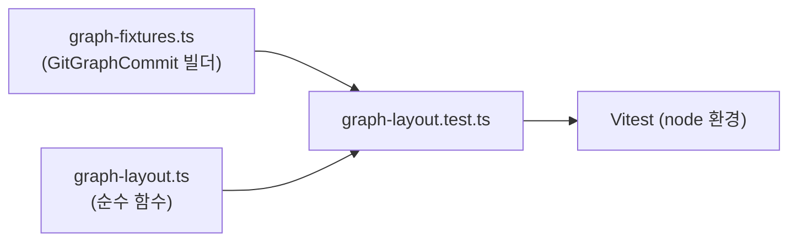

# graph-layout 테스트 추가 계획

## 배경

`apps/desktop/src/features/history-tree/model/graph-layout.ts`는 commit의 parent 관계로부터 lane(세로 열)과 segment(연결선)를 계산하는 **순수 함수 모듈**이다. mainline first-parent 추적, pending parent 예약, lane 재사용, 중간 행 pass-through 등 분기가 많은 알고리즘인데도 **테스트가 한 줄도 없다.**

반면 Rust 영역의 동등한 파서(`parse_commit_graph_history` 등)는 단위 테스트로 검증되고 있다. graph-layout은 프론트엔드에서 회귀 위험이 가장 높은 코드이며, `ChangesPanel` 분해([changes-panel-refactoring.md](./changes-panel-refactoring.md))의 안전망이 되므로 **가장 먼저** 테스트를 확보한다.

## 대상 함수

| 함수 | 입력 → 출력 | 검증 포인트 |
|------|-------------|-------------|
| `computeGitGraphRows` | `GitGraphCommit[]` → `Map<hash, GitGraphRow>` | lane 배치, nodeType, isMainline, connections |
| `getMaxGraphLane` | `Map<hash, GitGraphRow>` → `number` | row.lane 및 모든 segment의 fromLane/toLane 중 최댓값 |

`graph-layout.ts`는 순수 함수이고 Tauri/React 런타임에 의존하지 않으므로 DOM 없이 Node 환경에서 그대로 테스트할 수 있다.

## 도구 도입: Vitest

프론트엔드 테스트 러너가 아직 없다. Vite 7을 이미 쓰고 있으므로 Vitest가 가장 자연스럽다.



### 설정 단계

1. `apps/desktop`에 dev 의존성 추가: `vitest`.
2. `apps/desktop/package.json` scripts에 추가:
   ```json
   "test": "vitest run",
   "test:watch": "vitest"
   ```
3. 루트 `package.json`에 워크스페이스 일괄 실행용 스크립트 추가(선택):
   ```json
   "test": "pnpm -r --if-present test"
   ```
4. `apps/desktop/vite.config.ts`에 `test` 설정을 추가하거나 별도 `vitest.config.ts`를 둔다. lane 계산은 DOM이 필요 없으므로 `environment: "node"`로 충분하다. `@` alias가 테스트에서도 동작하도록 기존 resolve alias를 공유한다.

> 참고: 현재 graph-layout 테스트만이라면 `environment: "node"`로 충분하다. 이후 컴포넌트 렌더 테스트까지 확장하면 `jsdom` + `@testing-library/react`를 추가한다(이번 과제 범위 밖).

## 테스트 픽스처

`GitGraphCommit`을 매번 손으로 만들면 장황하다. 픽스처 빌더를 둔다.

```ts
// apps/desktop/src/features/history-tree/model/graph-fixtures.ts
import type { GitGraphCommit } from "@/entities/repository";

export function commit(
  overrides: Partial<GitGraphCommit> & Pick<GitGraphCommit, "hash">,
): GitGraphCommit {
  return {
    shortHash: overrides.hash.slice(0, 7),
    parents: [],
    message: `commit ${overrides.hash}`,
    author: "Test Author",
    date: "2026-06-25T00:00:00+09:00",
    isHead: false,
    isMerge: (overrides.parents?.length ?? 0) > 1,
    ...overrides,
  };
}
```

## 검증 시나리오

graph는 **최신 커밋이 배열 앞(index 0)**, parent가 뒤에 오는 topo-order를 가정한다(`git_cli.rs`의 `--topo-order`).

| 시나리오 | 입력 형태 | 기대 결과 |
|----------|-----------|-----------|
| 빈 입력 | `[]` | 빈 Map |
| 선형 히스토리 | `A→B→C` (모두 first-parent) | 전부 `lane 0`, `isMainline true` |
| HEAD 표시 | `A(isHead)` | `A.nodeType === "head"` |
| 머지 커밋 | `M(parents:[A,B])` | `M.nodeType === "merge"`, side branch는 `lane ≥ 1` |
| 사이드 브랜치 lane 배정 | 분기 후 머지 | side commit은 `lane 1` 이상, mainline은 `lane 0` 유지 |
| lane 재사용 | 머지로 닫힌 lane이 이후 다른 브랜치에 재사용 | 동일 lane 번호 재등장 |
| pass-through 세그먼트 | parent가 여러 행 떨어짐 | 중간 행에 `type: "vertical"` segment 존재 |
| `getMaxGraphLane` | 3개 lane 사용 그래프 | `2` 반환 |

## 테스트 케이스 예시

```ts
// apps/desktop/src/features/history-tree/model/graph-layout.test.ts
import { describe, expect, it } from "vitest";
import { commit } from "./graph-fixtures";
import { computeGitGraphRows, getMaxGraphLane } from "./graph-layout";

describe("computeGitGraphRows", () => {
  it("빈 커밋 목록은 빈 Map을 반환한다", () => {
    expect(computeGitGraphRows([]).size).toBe(0);
  });

  it("선형 히스토리는 모든 커밋을 lane 0 mainline으로 배치한다", () => {
    const commits = [
      commit({ hash: "c", parents: ["b"], isHead: true }),
      commit({ hash: "b", parents: ["a"] }),
      commit({ hash: "a", parents: [] }),
    ];

    const rows = computeGitGraphRows(commits);

    for (const hash of ["a", "b", "c"]) {
      expect(rows.get(hash)?.lane).toBe(0);
      expect(rows.get(hash)?.isMainline).toBe(true);
    }
    expect(rows.get("c")?.nodeType).toBe("head");
    expect(getMaxGraphLane(rows)).toBe(0);
  });

  it("머지 커밋은 merge 노드로 표시하고 side branch를 lane 1 이상에 둔다", () => {
    // m = merge(main=a, feature=f), f = feature commit, a = base
    const commits = [
      commit({ hash: "m", parents: ["a", "f"] }),
      commit({ hash: "f", parents: ["a"] }),
      commit({ hash: "a", parents: [] }),
    ];

    const rows = computeGitGraphRows(commits);

    expect(rows.get("m")?.nodeType).toBe("merge");
    expect(rows.get("m")?.lane).toBe(0);
    expect(rows.get("a")?.lane).toBe(0);
    expect(rows.get("f")?.lane).toBeGreaterThanOrEqual(1);
    expect(getMaxGraphLane(rows)).toBeGreaterThanOrEqual(1);
  });

  it("parent가 여러 행 떨어지면 중간 행에 pass-through 세그먼트를 만든다", () => {
    // x의 parent z 사이에 무관한 커밋 y가 끼어 있는 경우
    const commits = [
      commit({ hash: "x", parents: ["z"] }),
      commit({ hash: "y", parents: ["z"] }),
      commit({ hash: "z", parents: [] }),
    ];

    const rows = computeGitGraphRows(commits);
    const hasVerticalPassThrough = [...rows.values()].some((row) =>
      row.connections.some((segment) => segment.type === "vertical"),
    );

    expect(hasVerticalPassThrough).toBe(true);
  });
});
```

## 골든(스냅샷) 테스트 보강

분해 리팩터링의 안전망이 목적이라면, 대표적인 복잡 그래프 하나를 입력해 전체 `rows` 결과를 스냅샷으로 고정하는 것이 효과적이다.

```ts
it("대표 그래프의 레이아웃 결과를 고정한다", () => {
  const rows = computeGitGraphRows(complexGraphFixture);
  expect(Object.fromEntries(rows)).toMatchSnapshot();
});
```

색상은 `hashString` 기반 결정론적 함수이므로 스냅샷이 안정적이다. 단, `GRAPH_COLORS` 팔레트나 해시 로직을 의도적으로 바꿀 때는 스냅샷을 함께 갱신해야 한다.

## 완료 기준

- [ ] `pnpm --filter desktop test`로 graph-layout 테스트가 실행된다.
- [ ] 위 시나리오 표의 모든 항목이 케이스로 존재한다.
- [ ] 대표 복잡 그래프의 스냅샷이 존재한다.
- [ ] `pnpm typecheck`가 통과한다.
