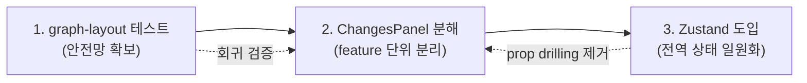

# 프로젝트 개선 로드맵

## 배경

`tauri-git-explorer`는 헥사고날 아키텍처(Rust)와 feature sliced design(React)을 기반으로 빠르게 기능을 쌓아왔다. Rust 영역은 port/adapter 분리와 단위 테스트(34개)가 잘 갖춰져 있으나, React 영역에는 다음 세 가지 구조적 부채가 남아 있다.

1. `ChangesPanel.tsx`가 단일 파일 약 1,600줄로 비대해져 feature sliced design의 경계가 무너져 있다.
2. 복잡한 graph layout 알고리즘(`graph-layout.ts`)에 테스트가 전혀 없어 회귀 위험이 높다.
3. AGENTS.md가 규정한 "클라이언트 전역 상태는 Zustand" 지침이 실제 코드에 반영되지 않았다(의존성에 Zustand 부재).

이 문서는 세 개선 과제의 우선순위와 상호 의존 관계를 정리하고, 각 과제의 상세 계획 문서로 연결한다.

## 개선 과제

| # | 과제 | 상세 문서 | 핵심 목표 | 위험도 |
|---|------|-----------|-----------|--------|
| 1 | graph-layout 테스트 추가 | [graph-layout-testing.md](./graph-layout-testing.md) | 리팩터링 안전망 확보 | 낮음 |
| 2 | `ChangesPanel` 분해 | [changes-panel-refactoring.md](./changes-panel-refactoring.md) | feature 단위 책임 분리 | 높음 |
| 3 | Zustand 도입 | [client-state-with-zustand.md](./client-state-with-zustand.md) | UI 전역 상태 일원화, 지침 정합 | 중간 |

## 권장 진행 순서

리팩터링(과제 2)은 가장 효과가 크지만 위험도 가장 높다. 따라서 **테스트로 안전망을 먼저 깐 뒤(과제 1) → 컴포넌트를 분해하고(과제 2) → 분해 과정에서 드러난 UI 전역 상태를 Zustand로 정리(과제 3)** 하는 순서를 권장한다.

- **과제 1을 먼저** 하는 이유: `computeGitGraphRows`의 lane 배치 결과는 분해 과정에서 컴포넌트 이동·import 변경의 영향을 받기 쉽다. 테스트가 있으면 "분해 전/후 출력 동일"을 즉시 검증할 수 있다.
- **과제 3을 마지막**에 두는 이유: 어떤 상태를 전역으로 올릴지는 컴포넌트를 feature로 쪼개 본 뒤라야 경계가 분명해진다. 분해 전에 store부터 만들면 불필요한 전역 상태가 생기기 쉽다.

## 공통 원칙

- **상태 경계 유지**: 서버 상태·캐시·revalidation은 React Query, UI 전역/선택/표시 옵션은 Zustand, 컴포넌트 내부 한정 상태는 local state로 분리한다(AGENTS.md State Management 규칙).
- **Storybook 동반**: 새로 분리하는 React 컴포넌트는 atomic design 규칙에 맞춰 Storybook에 등록하고 empty/loading/error 등 다양한 상태 샘플을 포함한다.
- **Rust 영역 무변경**: 세 과제 모두 React 영역에 한정된다. Tauri command·application port·domain 모델은 변경하지 않는다.
- **점진적 적용**: 각 과제는 하나의 큰 커밋이 아니라 독립적으로 머지 가능한 단위로 쪼개 진행한다.
